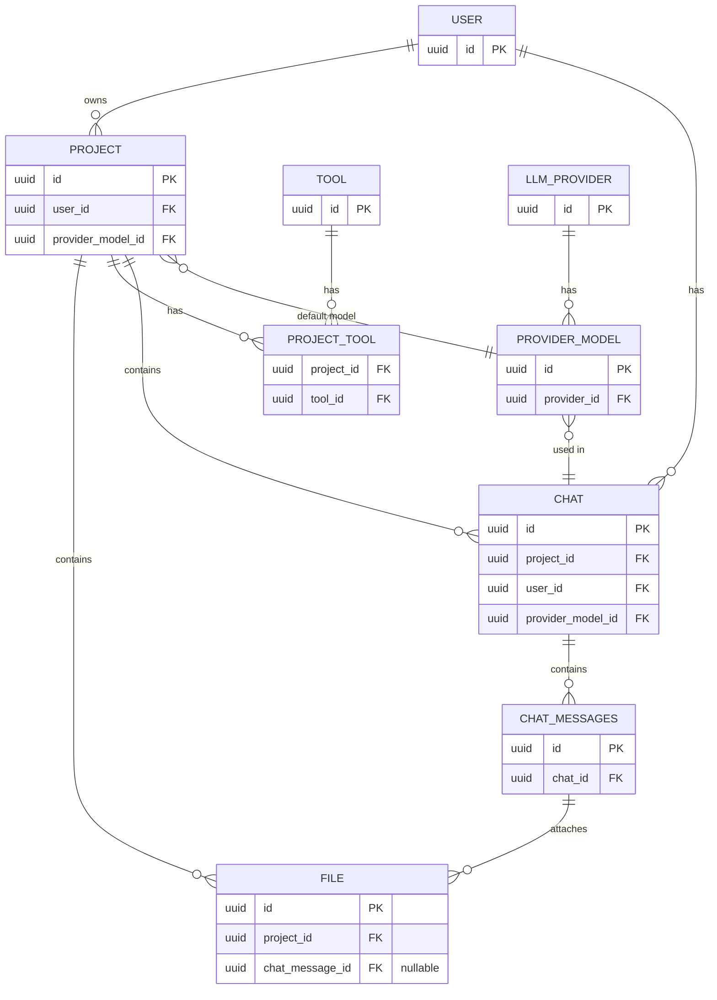

> **Note:** This is a developer design document for future planned features (projects, files, tools). It does NOT reflect the current database schema. For the current schema, see the OpenSpec specs in `openspec/specs/` (specifically `user-management`, `llm-provider-api`, `chat-api`) and the implementation in `backend/src/db/index.ts`.

