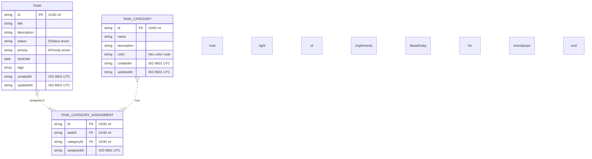

# Design: Entity ID, GUID, Timestamp & Categories Enhancement

## Context

### Background
The current Task Management Utility has the following characteristics:
- Uses a simple timestamp-based ID generation: `${Date.now()}-${Math.random().toString(36).substr(2, 9)}`
- No timestamp fields (createdAt, updatedAt) on entities
- No dedicated category entity - only simple string tags on tasks
- All entities share the BaseRepository for CRUD operations

### Current State Analysis
- **ITask interface**: Contains id, title, description, status, priority, dueDate, tags
- **Task entity**: Domain class implementing ITask with business logic
- **BaseRepository**: Abstract repository with CRUD operations, uses timestamp-random ID generation
- **Storage**: LocalStorage with namespace prefix `tnolva_`

### Constraints
- Must maintain backward compatibility where possible
- TypeScript strict typing required
- Clean code principles with modular structure
- All interfaces prefixed with `I`, enums with `E`

### Stakeholders
- Task management application users who need organized task categorization
- Developers maintaining the codebase

## Entity Relationship Diagram

## Goals / Non-Goals

**Goals:**
1. Create reusable IEntityId interface for consistent ID handling across all entities
2. Implement proper UUID v4 generation using crypto.randomUUID()
3. Add IBaseEntity with createdAt and updatedAt timestamps
4. Create TaskCategory entity with full CRUD support
5. Integrate category relationship into Task entity
6. Update BaseRepository to automatically handle timestamps

**Non-Goals:**
1. User authentication/authorization
2. Cloud sync or multi-device support
3. Complex querying beyond current IQueryBuilder capabilities
4. Migration scripts for existing data (handled separately)

## Decisions

### Decision 1: UUID v4 over Custom ID Generation

**Choice:** Use native `crypto.randomUUID()` for ID generation

**Rationale:**
- Cryptographically secure and truly random
- Standard UUID v4 format (36 chars with hyphens)
- No external dependencies required
- Better collision resistance than timestamp-based approach

**Alternatives Considered:**
- Timestamp + random: Current approach - not truly unique, poor distribution
- Snowflake IDs: Over-engineered for client-side only app
- Custom base62: Still needs randomness, less standard

### Decision 2: ISO 8601 Date Strings over Date Objects

**Choice:** Store timestamps as ISO 8601 strings

**Rationale:**
- JSON serialization friendly
- Easy to compare and sort
- Timezone agnostic
- Works well with localStorage (no Date prototype issues)

**Alternatives Considered:**
- Unix timestamps (number): Less readable, harder to debug
- Date objects: serialization issues with localStorage

### Decision 3: Eager Timestamps in BaseRepository

**Choice:** Automatically set createdAt on create, updatedAt on update in BaseRepository

**Rationale:**
- Ensures consistency across all entities
- Reduces boilerplate in domain classes
- Single source of truth for timestamp logic

**Alternatives Considered:**
- Manual timestamps in domain: Error-prone, repetitive
- Lazy timestamps on read: Performance overhead, inconsistent

### Decision 4: Separate Category Entity Over Tags

**Choice:** Dedicated TaskCategory entity with relationship to Task

**Rationale:**
- Categories can have their own properties (name, color, description)
- Better for hierarchical organization
- Enables category-specific metadata
- More scalable than flat tags

**Alternatives Considered:**
- Enhanced tags: Tags remain simple, good for flexible labeling
- Categories as tags: Complicates the existing tag model

### Decision 5: Many-to-Many Relationship Between Tasks and Categories

**Choice:** Use a junction table (TASK_CATEGORY_ASSIGNMENT) for many-to-many relationship

**Rationale:**
- A task can belong to multiple categories
- A category can have multiple tasks assigned
- Allows flexible organization without modifying entity schemas
- Easy to add/remove assignments without affecting core entities

**Alternatives Considered:**
- One-to-many (Task → Category): Too restrictive
- Many-to-one (Category → Task): Doesn't allow task flexibility
- Embedded array of categoryIds in Task: Harder to query and maintain

## Risks / Trade-offs

### Risk: ID Format Migration
Existing tasks use timestamp-random IDs. New tasks will use UUID format.

**Mitigation:**
- Consider migration utility to convert existing IDs
- Or accept mixed ID formats (both are strings)
- Tests should verify both formats work

### Risk: Timestamp Backwards Compatibility
Adding required createdAt/updatedAt to ITask interface could break existing code.

**Mitigation:**
- Make timestamps optional in DTOs for creation
- Add default values when reading from storage
- Provide migration path for existing data

### Risk: Circular Dependencies
Adding category repository to UnitOfWork could create circular dependencies.

**Mitigation:**
- Use dependency injection pattern
- Keep repositories as separate modules
- UnitOfWork orchestrates but doesn't import domain logic

### Risk: Performance Impact
Auto-timestamping on every update could impact performance.

**Mitigation:**
- Only update updatedAt when actual changes occur
- Use shallow comparison to detect changes
- Batch operations minimize overhead

## Migration Plan

### Phase 1: Interface Extensions
1. Create IEntityId interface
2. Create IBaseEntity interface with timestamps
3. Update ITask to extend IBaseEntity

### Phase 2: Utility Creation
4. Create guid.ts utility using crypto.randomUUID()
5. Update BaseRepository to use GUID utility

### Phase 3: Category Implementation
6. Create ITaskCategory interface
7. Create TaskCategory domain entity
8. Create ICategoryRepository interface
9. Create CategoryRepository implementation

### Phase 4: Integration
10. Update BaseRepository for timestamp handling
11. Update Task entity
12. Update UnitOfWork
13. Update DTOs

### Rollback Strategy
- Git-based rollback to previous commit
- No database migration to reverse
- Interface changes require recompilation of dependent code

## Open Questions

1. **Should categories support nesting (subcategories)?**
   - Current design supports flat categories only
   - Can extend later if needed

2. **Should we implement soft delete for categories?**
   - Not in initial scope
   - Can add isDeleted flag if needed

3. **How to handle tasks referencing deleted categories?**
   - Option A: Cascade delete tasks
   - Option B: Set categoryId to null
   - Decision: Set to null (safer, preserves data)

4. **Should timestamps be UTC or local time?**
   - Decision: UTC (ISO 8601 with Z suffix)
   - Display can convert to local time
