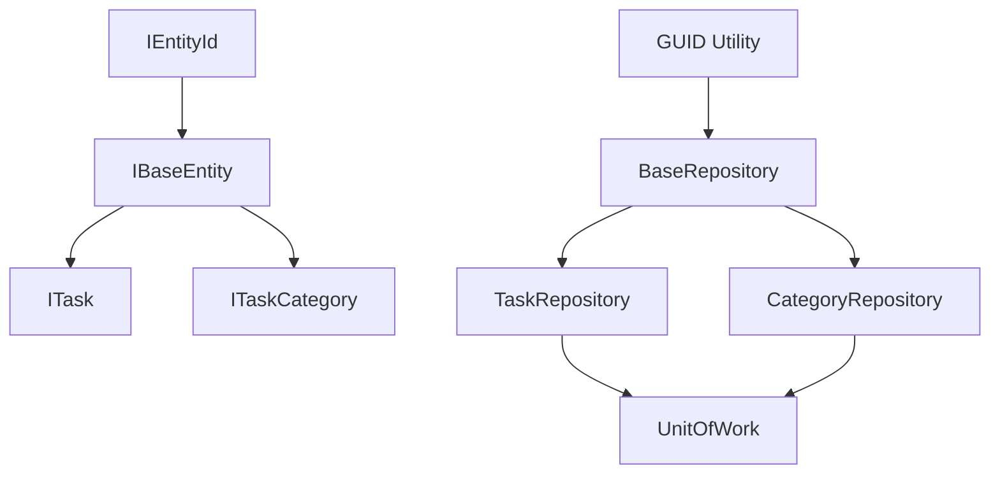

# Entity ID, GUID, Timestamp & Categories Change Plan

## Change Name
`entity-id-guid-timestamp-categories`

## Description
Extend the interface system with:
- Separate ID interface (IEntityId)
- GUID utility for ID generation
- Timestamps (createdAt, updatedAt) on all entities
- Custom task categories in separate entity with relationships
- Repository refactoring for timestamping

## Current State Analysis

### Existing Interfaces
- [`ITask`](src/interfaces/ITask.ts) - Task interface with id, title, description, status, priority, dueDate, tags
- [`IRepository<T>`](src/interfaces/IRepository.ts) - Generic repository interface
- [`ITaskRepository`](src/interfaces/ITaskRepository.ts) - Task-specific repository
- [`IUnitOfWork`](src/interfaces/IUnitOfWork.ts) - Unit of work interface

### Existing Domain
- [`Task`](src/domain/Task.ts) - Task entity class
- Uses simple ID generation: `${Date.now()}-${Math.random().toString(36).substr(2, 9)}`

### Existing Repository
- [`BaseRepository`](src/data/repositories/BaseRepository.ts) - Abstract base with CRUD operations
- No timestamp handling currently

## Implementation Plan

### Phase 1: Interface Extensions
1. **Create IEntityId interface** - Extract id property into reusable interface
2. **Create IBaseEntity interface** - Add createdAt and updatedAt timestamps
3. **Update ITask** - Extend IBaseEntity

### Phase 2: Utility Creation
4. **Create GUID utility** - Replace timestamp-based ID generation with proper UUIDs

### Phase 3: Category Entity
5. **Create ITaskCategory interface** - Category definition
6. **Create ICategoryRepository interface** - Category repository interface
7. **Create TaskCategory domain entity** - Category implementation
8. **Create CategoryRepository** - Repository implementation

### Phase 4: Repository Updates
9. **Update BaseRepository** - Use GUID utility, add timestamp handling
10. **Update storageKeys** - Add category storage key
11. **Update ITaskWithRelations** - Include category relationship

### Phase 5: Unit of Work Updates
12. **Update UnitOfWork** - Include CategoryRepository

### Phase 6: DTO Updates
13. **Update DTOs** - Add timestamp fields

### Phase 7: Testing
14. **Write tests** - Test new functionality

## Mermaid Diagram

## Files to Create/Modify

### New Files
- `src/interfaces/IEntityId.ts`
- `src/interfaces/IBaseEntity.ts`
- `src/interfaces/ITaskCategory.ts`
- `src/interfaces/ICategoryRepository.ts`
- `src/utils/guid.ts`
- `src/domain/TaskCategory.ts`
- `src/data/repositories/CategoryRepository.ts`

### Modified Files
- `src/interfaces/ITask.ts`
- `src/interfaces/index.ts`
- `src/domain/Task.ts`
- `src/data/repositories/BaseRepository.ts`
- `src/data/repositories/TaskRepository.ts`
- `src/data/repositories/index.ts`
- `src/data/storageKeys.ts`
- `src/data/unit-of-work/UnitOfWork.ts`
- `src/interfaces/ITaskWithRelations.ts`
- `src/interfaces/ITaskCreateDto.ts`
- `src/interfaces/ITaskUpdateDto.ts`
